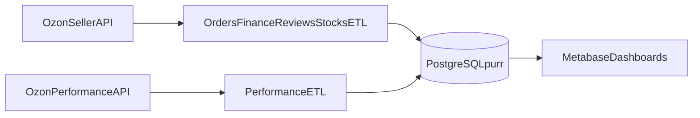

# Architecture Overview

`purr-analytics` is an ETL-first project that synchronizes Ozon operational data into PostgreSQL and exposes analytics-ready tables for Metabase.

## Module Responsibilities

- `src/cli` - entrypoints and run commands (`update_all`, debug tools, alerts launcher).
- `src/etl` - domain ETL pipelines (orders, finance, performance, reviews, analytics, stocks).
- `src/ozon` - Ozon API clients and transport helpers.
- `src/core` - shared runtime pieces (`config`, `db`, low-level utilities).
- `src/migrations` - idempotent schema setup and SQL views/functions.
- `src/catalog` - local SKU metadata (`flavor`, `grams`) to enrich `products`.

## Runtime Components

- `postgres` - source of truth for all ETL output tables and views.
- `metabase` - BI layer connected to `purr`.
- `etl_runner` - one-shot container to run `python -m src.cli.update_all`.

## Data Flow

## Hot Paths

- `src/etl/orders/load_orders.py` - highest DB write volume.
- `src/etl/finance/finance_api.py` - transaction-heavy fee ingestion.
- `src/etl/performance/orders.py` - attribution ingest + order backfill updates.

Recent cleanup moved repeated row writes to batched `execute_many(...)` where safe.
