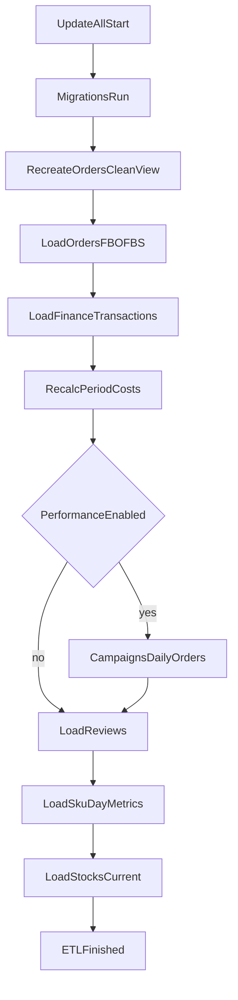

# ETL Flow (`src.cli.update_all`)

This flow is designed to be idempotent and safe for repeated runs over a lookback window.

## Step Order

1. Run migrations (`src.migrations.run`).
2. Recreate `orders_clean` view.
3. Load Ozon orders (FBO + FBS) and dependent entities (`customers`, `order_items`, posting fees).
4. Load finance transactions (`finance_api`) into `order_fee_items` with UPSERT by `uid`.
5. Recalculate period cost aggregates.
6. Optionally load performance block (campaigns, daily, attribution).
7. Optionally load reviews.
8. Optionally load SKU day metrics.
9. Optionally refresh current stocks (currently FBO-only inventory source).

## Diagram

## Operational Notes

- `ETL_STRICT_MODE=1` makes all step failures fatal.
- Performance block is gated by `ETL_ENABLE_PERFORMANCE=1`.
- Reviews/analytics/stocks can be toggled independently with `ETL_ENABLE_*`.
- Orders step includes order numbering recalculation; there is no extra duplicate recalculation step in `update_all`.
